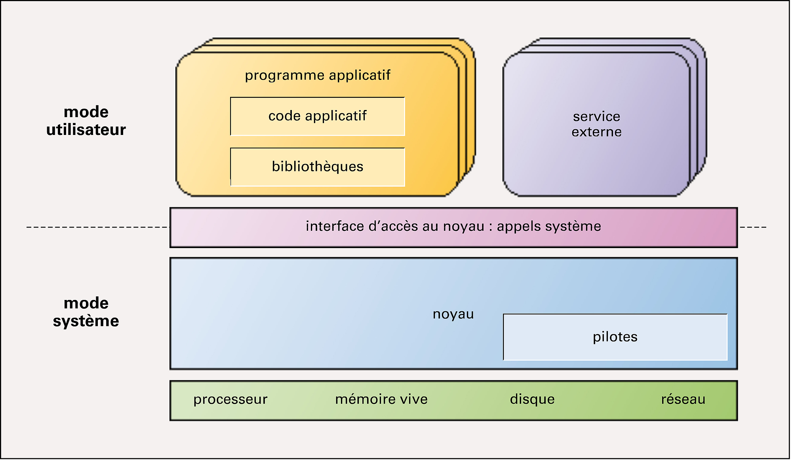

# Qu'est qu'un OS (Operating System)

## Qu'est ce que c'est
Ce terme désigne le logiciel intégré dans toute machine qui dispose d’un microprocesseur, et qui doit exécuter des programmes. Ce programme est le trait d'union entre les programmes écrits par l'utilisateur et les composants matériels qui composent cette machine.

## Son rôle
l'OS permet de gérer tous les éléments matériels d'une machine afin que les programmes puissent interagir avec les périphériques en utilisant les routines systèmes définies par l'OS, ces routines offrent ainsi une API qui va permettre aux programmes de s'exécuter dans de bonnes conditions.

## Comment ca marche
l’OS est constitué de plusieurs éléments indispensables :

- procédure d'initialisation:
	- initialisation de la mémoire
	- initialisation du matériel
	- initialisation des tables d’[interuptions](interruptions.md)
	- initialisation des [entrées-sorties](IO.md)
	- initialisation des listes de tâches
	- lancement des tâches système
	- …
- gestion du ou des [processeurs](processeurs.md)
- un [gestionnaire de mémoire](GestMemoire.md)
- un gestionnaire d'[entrées sorties](IO.md)
- un [gestionnaire de tâches](TaskManager.md)
- un [scheduler](scheduler.md) qui permet de gérer l'exécution des tâches

## Moniteur
Le [moniteur](moniteur.md) ou interpreteur de commandes, est un process un peu particulier qui doit permettre à l'utilisateur de communiquer avec l'OS alor qu'aucune application n'est installée sur la machine, c'est un espèce de shell qui est généralement lancé à la fin de la procédure d'initialisation, il doit permettre de lancer quelques commandes de base afin de visualiser des informations du système, et/ou lancer des tâches. Ce moniteur est le niveau le plus simple de l'interface homme/machine ([IHM](ihm.md)

## Bibliographie
Vous trouverez beaucoup de literature sur ce sujet, en voici quelques uns :

- Wikipedia donne [ici](https://fr.wikipedia.org/wiki/Liste_des_syst%C3%A8mes_d%27exploitation) une liste des systèmes d'exploitations.
- Un très bon article sur [commentcamarche.net](http://www.commentcamarche.net/contents/1092-systeme-d-exploitation)